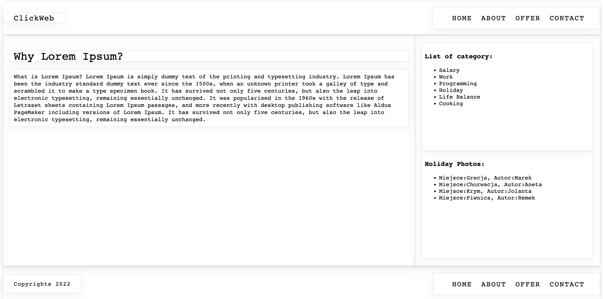

# Landing Page Skeleton - React

## Table of Contents
1. [About the project](#about-the-project)
2. [How to use it](#how-to-use-it)
3. [Technologies](#technologies)
4. [Solutions](#solutions)
5. [Project preview](#project-preview)
6. [Contact](#feel-free-to-contact-me)
7. [Thanks](#thanks-for-project-and-support-to-Mateusz-Bogolubow)

## About the project
The aim of this project was to learn to build website by using React library. I have practiced to build landing page skeleton by using small and big component (which are reusable).

This landing page contains:
- header
    - logo
    - menu
- column left (main content):
    - title
    - article
- column rigth (sidebar):
    - category list
    - gallery list
- footer
    - copyright information
    - menu

Each element is represented by separate component.
There are three large components:
* ``` <Header/> ```
* ``` <Content> ```
* ``` <Footer/> ```

The large components contain smaller components such as: ```<ContentTitle/>```or ```<Nav/>``` which is used twice in header and footer section.

During that practice I focused on to understand how React works and how to use it in a correct way, so I did not pay too much attention to the appearance part. Right now, I can provide my other projects where I focused more on design
and practiced CSS3.
* [LandingPage-HTML-CSS](https://github.com/EwelinaKopacz/LandingPage-HTML-CSS)
* [LandingPage-RWD](https://github.com/EwelinaKopacz/LandingPage-RWD)
* [LandingPage-CuDanusie](https://github.com/EwelinaKopacz/LandingPage-CuDanusie)

## How to use it
Download the data, clone my project
```
git clone <url>
```

Type into the terminal
```
npm i
```

Next, to run, type into the terminal:
```
npm start
```

## Technologies
* JavaScript
* React
* HTML
* CSS
* Desktop only version


## Solutions
By  undertaking this project I had an opportunity to learn:
* how React works
* JSX expressions
* virtual DOM (VDOM)
* functional and classes components (differences between then, and how to use)
* props and PropTypes
* how to pass data using props
* components build concept


### Project preview
Screenshot



### Feel free to contact me:
* [Linkedin](https://www.linkedin.com/in/ewelina-kopacz-929559100/) - Ewelina Kopacz


### Thanks for project and support to Mateusz Bogolubow:
* Mentor i Trener Programowania JavaScript - [DevMentor](https://devmentor.pl/) - Mateusz Bogolubow